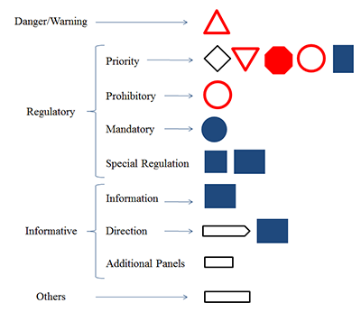

# Classification of Traffic Signs: The European Dataset


We introduce a real-world European dataset for traffic sign classification. The dataset is composed of traffic sings from six European countries: Belgium, Croatia, France, Germany, The Netherlands, and Sweden. It gathers publically available datasets and complements French traffic signs with images acquired in Belfort with the equipped UTBM autonomous vehicle. It is composed of more than 80 000 images divided in 164 classes that at the same time belong to four main categories following the Vienna Convention of Road Signs. We analyzed the intra variability of classes and compared the classification performance of five convolutional neural network architectures.

This repository contains the pre-trained weights obtained for the CNN architectures defined in "models" folder with two datasets:
- GTSRB 
- Our proposed European dataset

The European Traffic Sign Dataset is available upon request to the any of the following emails: citlalli.gamez-serna@utbm.fr, yassine.ruichek@utbm.fr


## Citation

The full paper details can be found in [IEEE Access](https://ieeexplore.ieee.org/abstract/document/8558481).

If you find our work useful for your research, please cite our paper:
```
@article{serna2018classification,
  title={Classification of Traffic Signs: The European Dataset},
  author={Serna, Citlalli G{\'a}mez and Ruichek, Yassine},
  journal={IEEE Access},
  year={2018},
  publisher={IEEE}
}
```
